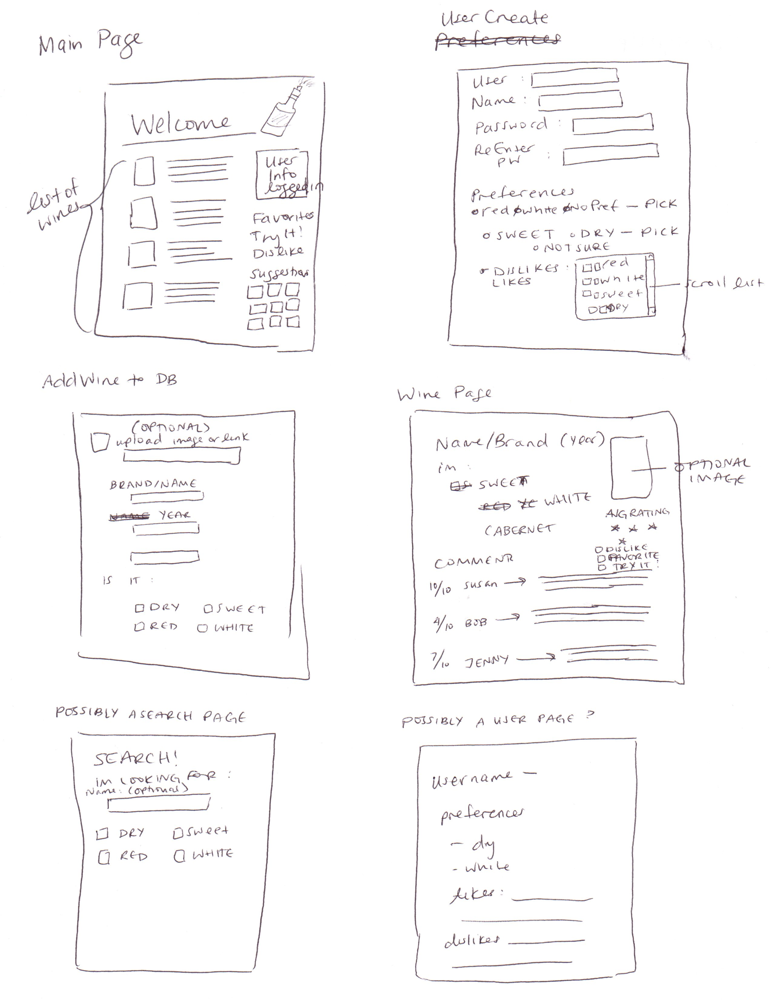
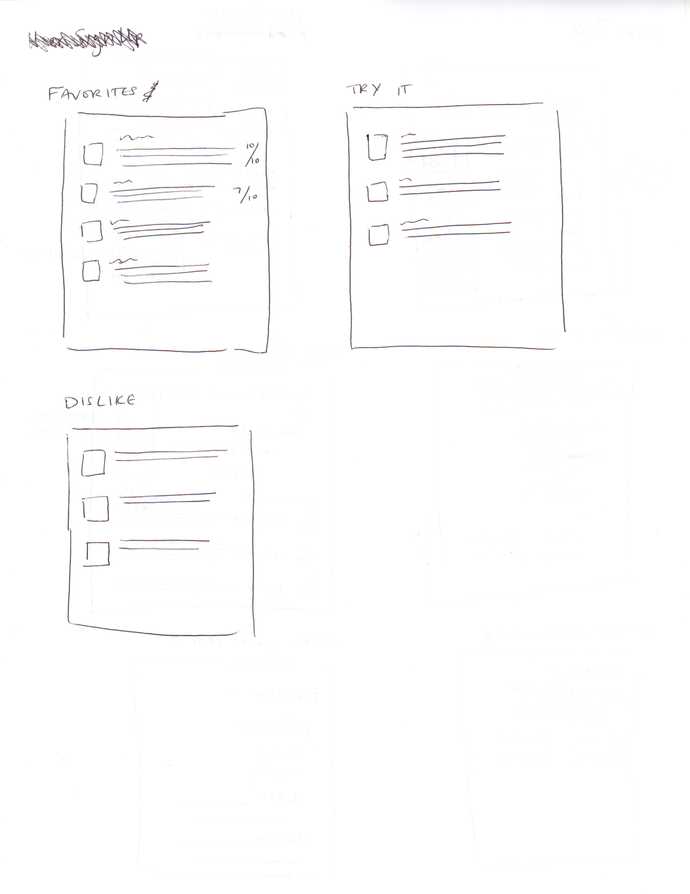
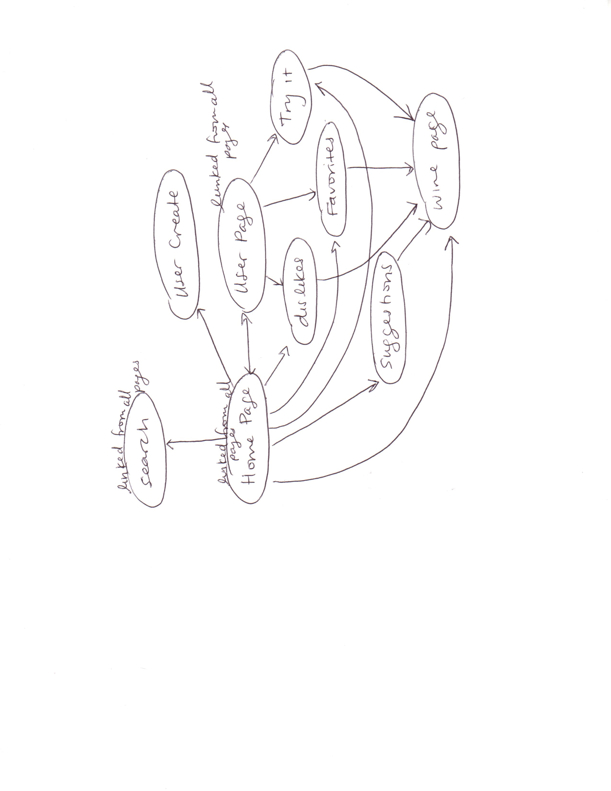

The content below is an example project proposal / requirements document. Replace the text below the lines marked "__TODO__" with details specific to your project. Remove the "TODO" lines.

(___TODO__: your project name_)

# "Wine Not"

## Overview

(___TODO__: a brief one or two paragraph, high-level description of your project_)

"Wine Not" is a web app that is meant for keeping track of your favorite wines and discovering new ones! We've got the top recommendations from wine lovers, like you, all over the globe! 
Create an account and set up your flavor profile! Receive recommendations using comments/ratings posted by people who have similar palettes. Keep track of all your favorite wines. Share new wine discoveries, whether it's sharing a bottle from a new, unknown brand or just sharing your thoughts
on a well known one! As a beginner wine lover, I always have a hard time discovering a new favorite or even just picking out an old one when I can't remember. Wine Not is built to help remedy that!

## Data Model

(___TODO__: a description of your application's data and their relationships to each other_) 

The application will store users, lists/collections, as well as items.
- users will be able to set up personal preferences -- red/white -- dry/sweet (properties)
--> Using these preferences, users will receive a list of suggestions out of all the wines stored in the site(mongodb.find())
- users will have multiple lists -- favorites, want to try, dislikes. (by references)
- each list can have multiple wine objects (by embedding)
- Wine objects will have their own properties -- red/white -- dry/sweet -- comments -- (possibly ratings) (properties)
- Users will be able to add wines to the general wine DB list (by embedding)

(___TODO__: sample documents_)

An Example User:

```javascript
{
  username: "WineLover10",
  pd: a password hash,
  lists: 	flavor profile: [color: 'noPref', acid: 'dry'],
		favorites: [wine249, wine 259, wine 0, wine 3],
		try: [wine 67, wine 43, wine 200],
		dislike: [wine 709, wine 213],
		recommendMe: 'Merlot', --if there's time
		dontShowMeAny: 'white' --if there's time
}
```

An Example of a single wine object with Embedded Items: -- There will be one overall list with all wine objects

```javascript
White:
{
  color: 'white'
  acid: 'sweet'
  image: //path to image in imageDB -- //OR ONLY ACCEPTS WEB LINKS
  type: 'Chardonnay'
  feedback: [{comment: "So bad!", user: "WineLover10", rate: 1}, {comment: "Its okay", user: "Kathy23T", rate: 5} ]
}

Red:
{
  color: 'red'
  acid: 'dry',
  image: //path to image in imageDB -- //OR ONLY ACCEPTS WEB LINKS
  type: 'Cabernet',
  feedback: [{comment: "So good!", user: "WineLover10", rate: 10}, {comment: "Too sour!", user: "Kathy23T", rate: 3} ]
}
```


##  

(___TODO__: create a first draft of your Schemas in db.js and link to it_)

## Wireframes

(___TODO__: wireframes for all of the pages on your site; they can be as simple as photos of drawings or you can use a tool like Balsamiq, Omnigraffle, etc._)





## Site map

(___TODO__: draw out a site map that shows how pages are related to each other_)



## User Stories or Use Cases

(___TODO__: write out how your application will be used through [user stories](http://en.wikipedia.org/wiki/User_story#Format) and / or [use cases](https://www.mongodb.com/download-center?jmp=docs&_ga=1.47552679.1838903181.1489282706#previous)_)

1. as non-registered user, I can register a new account with the site
2. as non-registered user, I can use the search function to look at wine pages
2. as a user, I can see other user pages
3. as a user, I can add/remove items from my favorite/try it/dislike lists
4. as a user, I can use the search function to look at wine pages
5. as a user, I can leave a review on a wine page

## Research Topics

(___TODO__: the research topics that you're planning on working on along with their point values... and the total points of research topics listed_)

* (5 points) Integrate user authentication
	* Minimally, implement sign up and registration
* (2 points) Use a CSS framework throughout your site, use a reasonable of customization of the framework (don't just use stock Bootstrap - minimally configure a theme):
	* Bootstrap
* (1 - 6 points) Per external API used
	* assign a point value to the library or module that you're using based on amount of effort and/or code required for integration
	* for example, angular 2 might be 6 points, while google maps might be 1 point
	* Must link to source code relevant to implementation and API documentation
		* Twitter Client - Twitter REST API (2 points)

9 points total out of 8 required points (___TODO__: addtional points will __not__ count for extra credit_)


## [Link to Initial Main Project File](app.js) 

(___TODO__: create a skeleton Express application with a package.json, app.js, views folder, etc. ... and link to your initial app.js_)

## Annotations / References Used 

(___TODO__: list any tutorials/references/etc. that you've based your code off of_)

1. [Working Around Bootstrap CSS - Background Color](http://stackoverflow.com/questions/10768891/how-to-change-the-default-background-color-white-to-something-else-in-twitter-bo)
2. [Basic Bootstrap Examples](http://getbootstrap.com/getting-started/#examples)
3. [HTML Form Guide](http://htmlreference.io/element/input/)
4. [HTML Form Year Dropdown](http://snipplr.com/view/4157/birth-year-dropdown/)
5. [HTML Image Override](http://stackoverflow.com/questions/980855/inputting-a-default-image-in-case-the-src-attribute-of-an-html-img-is-not-vali)
6. [NPM Twitter Client](https://github.com/desmondmorris/node-twitter)